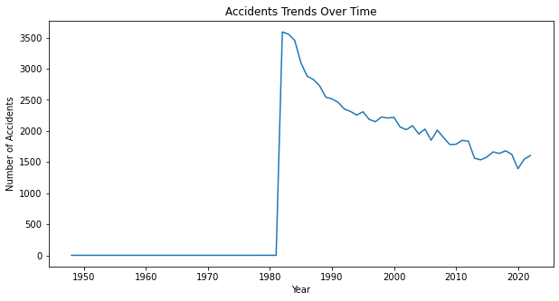
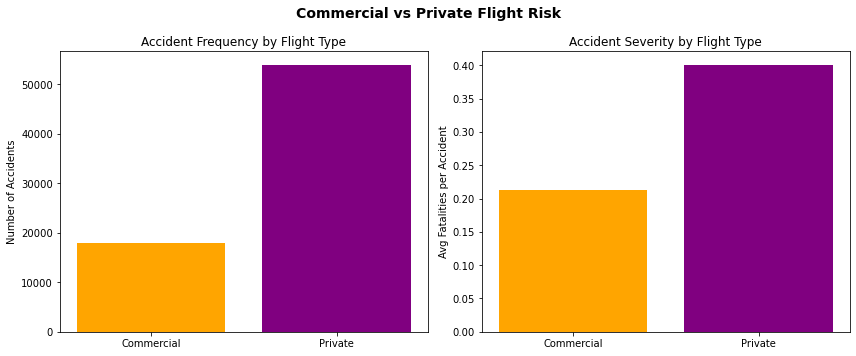

# Aircraft Risk Analysis

## Overview
This project analyzes aviation accident data from the **National Transportation Safety Board** to identify the lowest-risk aircraft models and manufacturers.  

The company is considering expansion into the aviation industry and needs to understand potential risks before investing in aircraft for **commercial and private enterprises**.  
The goal is to guide this expansion with **data-driven purchase decisions** that minimize operational risk and maximize passenger safety.  

## Business Understanding
- **Problem Statement:**  
  Which aircraft are safest for our company to purchase as we expand into the aviation industry?

- **Objectives:**  
  1.To assess historical aircraft accident trends (1962–2023).  
  2.To identify aircraft types and manufacturers with the lowest risks.  
  3.To provide actionable recommendations for executives.  

- **Stakeholders:**  
  - Company executives exploring diversification.  
  - Head of Aviation Division (decision-maker for purchases).  
  - Data science team (analysts and advisors).  

## Data Understanding
- **Source:** National Transportation Safety Board Aviation Accident Database  
- **Coverage:** 1962–2023  
- **Scope:** Civil aviation accidents and selected incidents in the United States and international waters  

- **Size:** 90348 rows and 31 columns

- **Columns Overview (examples):**  
  - `Event.Date` → Date of accident/incident  
  - `Location` → City/State/Country of event  
  - `Aircraft.Category` → E.g.Airplane, Helicopter
  - `Make` → Aircraft manufacturer (e.g., Boeing, Cessna, Piper)  
  - `Model` → Specific aircraft model  
  - `Injury.Severity` → Fatal, Incident, Non-Fatal  
  - `Total.Fatal.Injuries` → Number of fatal injuries in the event  
  - `Total.Serious.Injuries` → Number of serious injuries
  - `Purpose.of.flight` → Personal, commercial, training, etc.  

- **Data Types:**  
  - Categorical: Make, Model, Aircraft.Category, Injury.Severity, Purpose.of.flight  
  - Numerical: Total.Fatal.Injuries, Total.Serious.Injuries

*(See data for complete columns)*

## Key Analysis & Insights
- **Trend over Time:** Aviation safety has improved significantly, with accidents declining since the 1980s.  
- **By Flight Purpose:**  
  - Commercial flights → lower accident frequency and lower average fatalities per accident.  
  - Private flights → higher accident frequency and higher severity.  
- **By Manufacturer & Model:**  
  - Manufacturers like **Grumman-Schweizer, Raven, and Stinson** stand out for low accident severity.  
  - Aircraft models such as **Boeing 777, EMB-145LR, and Boeing 757-232** show multiple incidents but **zero recorded fatal accidents**, making them strong candidates.  

*(See Jupyter Notebook for full analysis, code, and visuals.)*

---

## 📊 Visuals

### 1. Accident Trends Over Time  
Aviation safety improvements are clear, with a steady decline in accidents since the 1980s.  

  

---

### 2. Accident Frequency & Severity by Flight Type  
Commercial flights show lower accident frequency and severity compared to private flights.  

  

*(See Jupyter Notebook for full analysis, code, and visuals.)*

---

## Interactive Dashboard
[See Tableau Dashboard](https://public.tableau.com/app/profile/mwanaisha.joho/viz/Book1_17586223399890/Dashboard1?publish=yes) 

The dashboard provides interactive visualizations of:  
- Accident trends over time  
- Top Aircraft manufacturer by fatality
- Accident frequency by purpose of flight

---

## Conclusion
- Safety has improved steadily since the 1980s.  
- Commercial aviation consistently shows **lower risk** compared to private aviation.  
- Certain manufacturers and models (e.g., **Boeing 777, EMB-145LR, Boeing 757-232**) demonstrate excellent safety records with **no fatal accidents**.  
- These insights strongly suggest prioritizing **commercial operations** and selecting proven safe models.  

---

## Recommendations
1. **Prioritize Commercial Aviation**  
   - Enter commercial aviation first due to lower accident frequency and severity.  
   - Position private aviation as a long-term secondary expansion area.  

2. **Select Aircraft from Safe Manufacturers & Models**  
   - Focus on manufacturers like **Grumman-Schweizer, Raven, Stinson**.  
   - For commercial, prioritize proven safe models like **Boeing 777, EMB-145LR, Boeing 757-232**.  

3. **Leverage Safety as a Competitive Advantage**  
   - Highlight investment in historically safe aircraft in branding and marketing.  
   - Use safety as a differentiator with customers, regulators, and insurers.  

---

## Next Steps
- **Operational Validation:** Cross-check safety insights with operating cost data (fuel, maintenance, spares).  
- **Regulatory & Regional Analysis:** Validate findings against regions of intended operation (weather, regulations, infrastructure).  
- **Insurance & Risk Modeling:** Work with insurers to model premiums and future risks.  
- **Predictive Modeling:** Extend analysis to forecast **future accident likelihood** using machine learning.  

---
